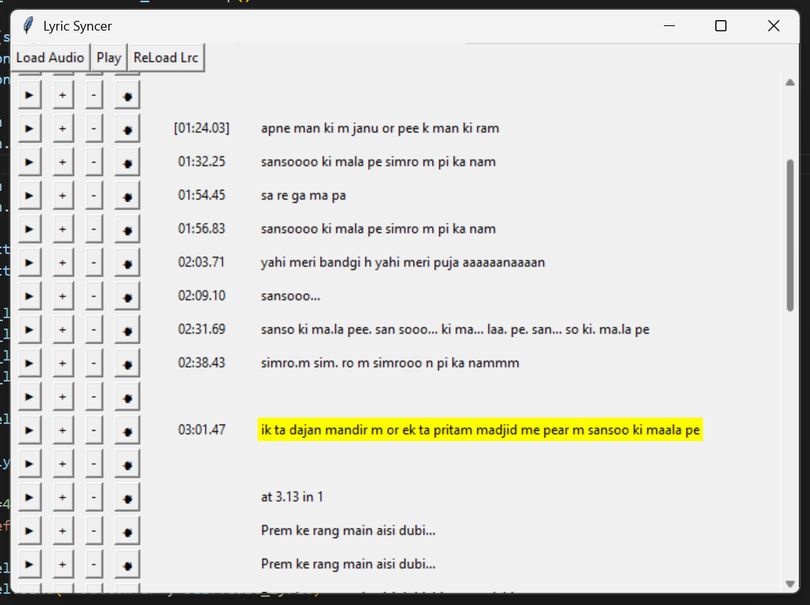

# 🎶 Lyrics Sync Tool

A simple Python desktop tool to **play audio files with synchronized lyrics** (`.lrc` format).  
It also lets you **edit, timestamp, or delete lyric lines** with an easy-to-use GUI.

---

## ✨ Features
- Play `.mp3` or `.wav` audio files.
- Load matching `.lrc` lyrics (if present).

### Main Bar
- **Load Audio** → Open File Dialog and load mp3 or wav file.
- **Play/Pause** → Control playback.
- **Reload Lyrics** → Re-read `.lrc` file.
- **Delay All** → Add a delay to all lyric lines.
- **Hasten All** → Remove a delay from all lyric lines.

### Lyrics Line Features
- **Play** → Play from selected Timestap.
- **+** → Add Delay to selected Timestamp.
- **-** → Remove Delay from selected Timestamp.
- **Timestamp** → Apply current time to selected Timestamp.
- **Edit Lyrics** → Click lyric to edit lyric text.
- **x** → Remove selected lyric line.
- **↓** → Add Empty Line below selected lyric line.
- **Highlight current line** while the song is playing.
- **Current line highlight:** See which lyric is currently playing in real time.
- Auto-wrapping for long lyric lines.
- `.lrc` file updates instantly (no need to manually save).

---

## 🛠 Requirements
- Python 3.8+
- Dependencies:
  - `pygame` (for audio playback)
  - `tkinter` (for GUI, comes pre-installed with Python on most systems)

Install pygame via pip:

~~~bash
pip install pygame
~~~

---

## 🚀 Usage

1. Clone or download this repo.
2. Run the app:

~~~bash
python sync.py
~~~

3. Open an `.mp3` or `.wav` file:
   - If a matching `.lrc` exists (`filename.lrc`), it will load automatically.
   - If no `.lrc` exists, you can add lines manually.

---

## 📂 Example `.lrc` formats

With timestamps:
~~~lrc
[00:50.71] जुदा होके भी
[00:55.57] तू मुझमें कहीं बाकी है
[01:01.64] पलकों में बनके आँसू, तू चली आती है
~~~

Without timestamps (will be synced manually):
~~~lrc
जुदा होके भी
तू मुझमें कहीं बाकी है
पलकों में बनके आँसू, तू चली आती है
~~~

---

## 💡 Workflow Tip
Instead of re-running `sync.py` every time you make small code changes, you can use:

- **[watchdog](https://pypi.org/project/watchdog/)** or **`python -m watchdog`** to auto-restart when files change.
- Or run in **VS Code with auto-reload** (`F5` debugging, restart on save).
- Or use **`watchmedo auto-restart`**:
  ~~~bash
  watchmedo auto-restart --pattern="*.py" --recursive -- python sync.py
  ~~~

---

## 📜 License
MIT License – free to use, modify, and distribute.

---

## 👨‍💻 Author
Built with ❤️ using Python, Tkinter, and Pygame.
